# Diagrammes des Design Patterns

## 1. Abstract Factory Pattern

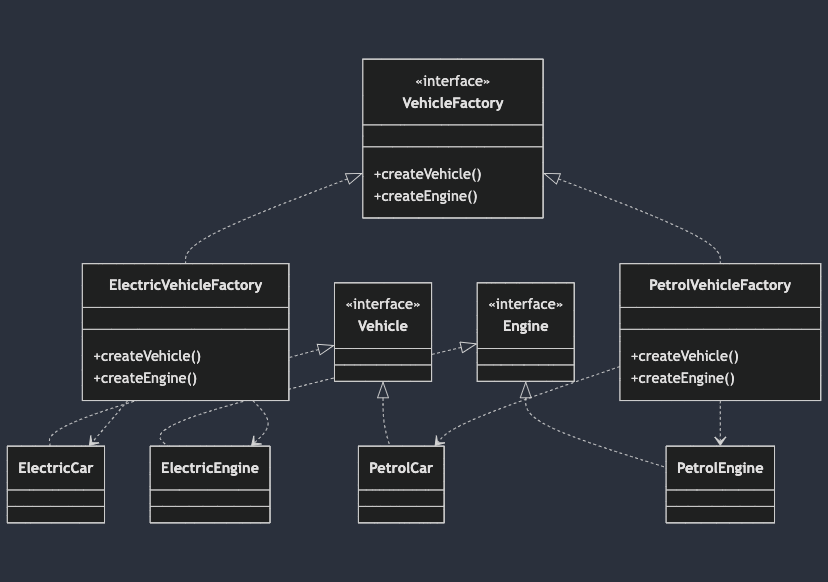

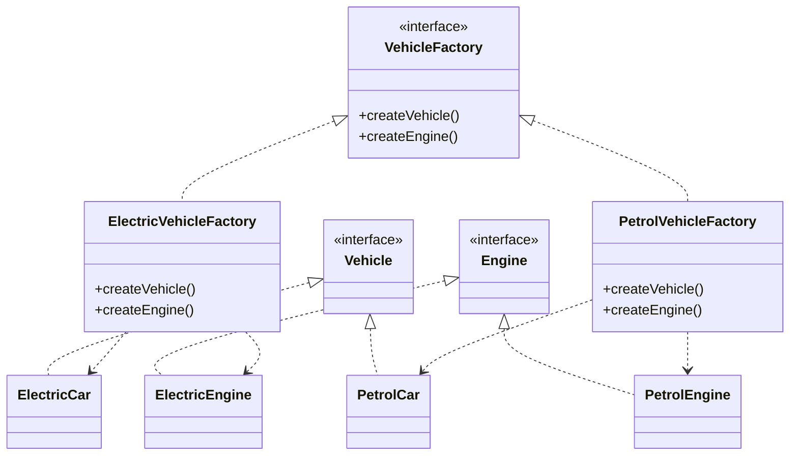

## 2. Builder Pattern (Documents)

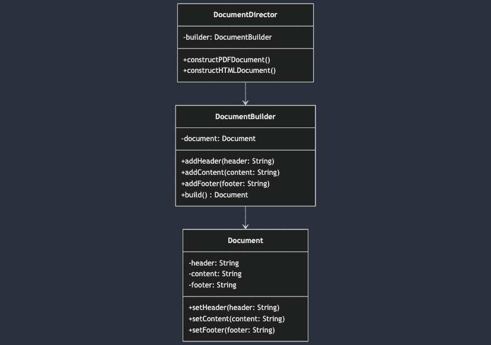

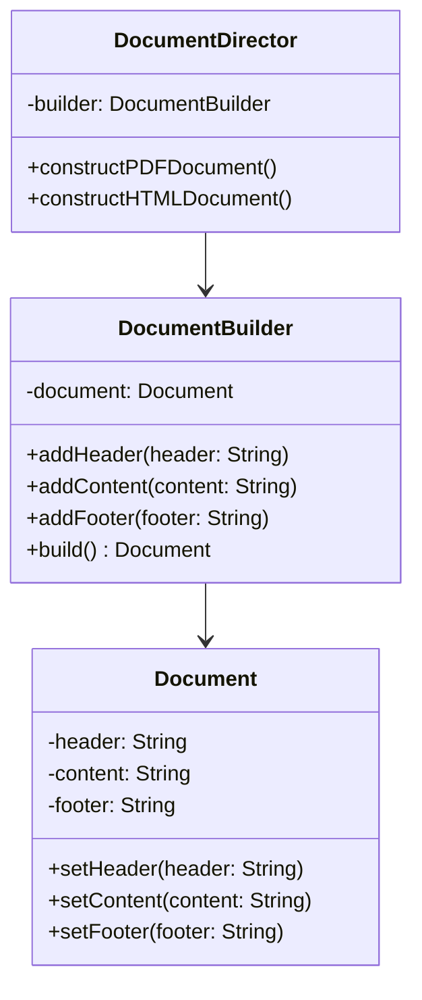

## 3. Factory Method Pattern (Commandes)

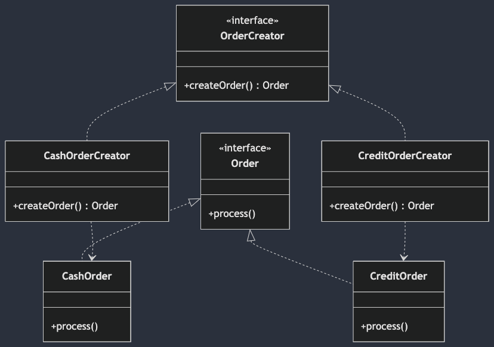

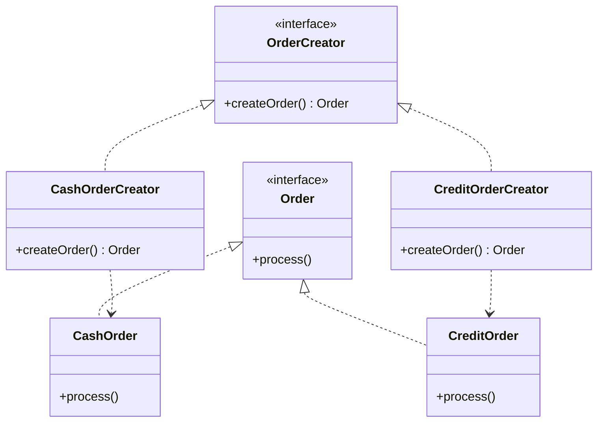

## 4. Composite Pattern (Sociétés)

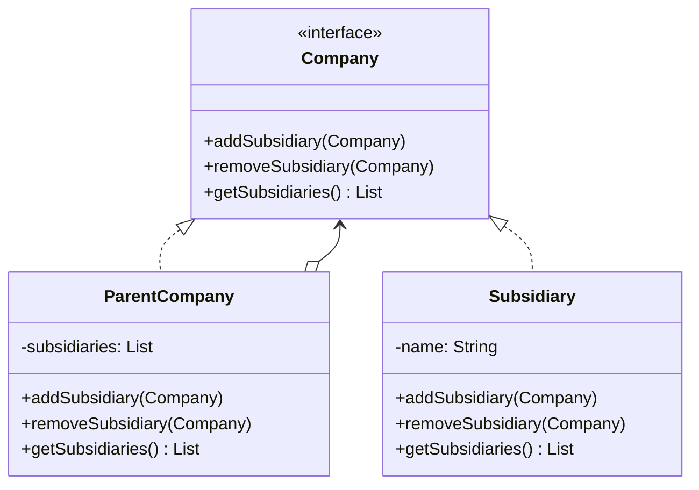

## 5. Observer Pattern (Catalogue)

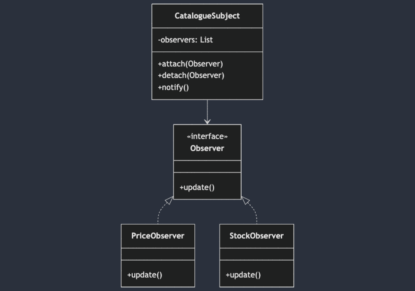

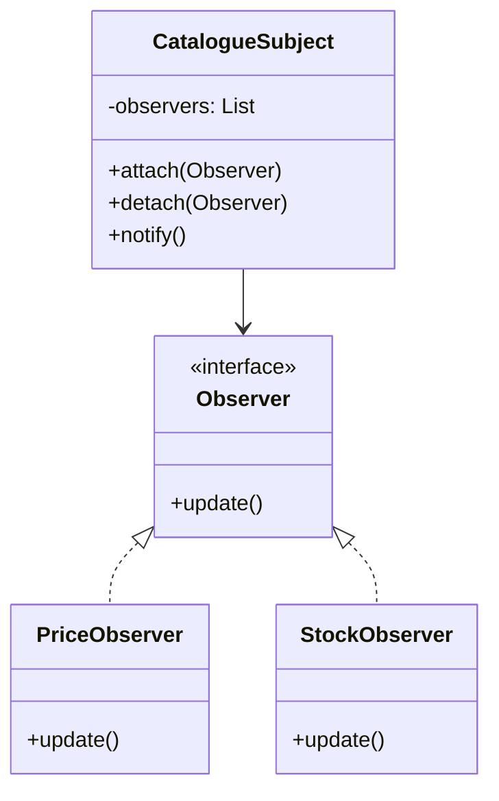

## 6. Decorator Pattern (Options Véhicule)

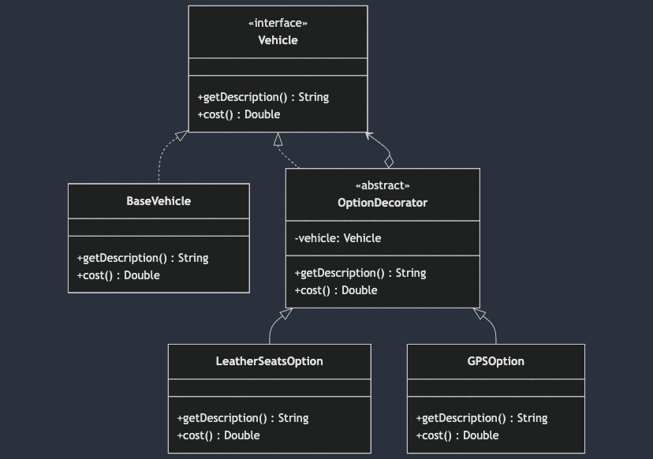

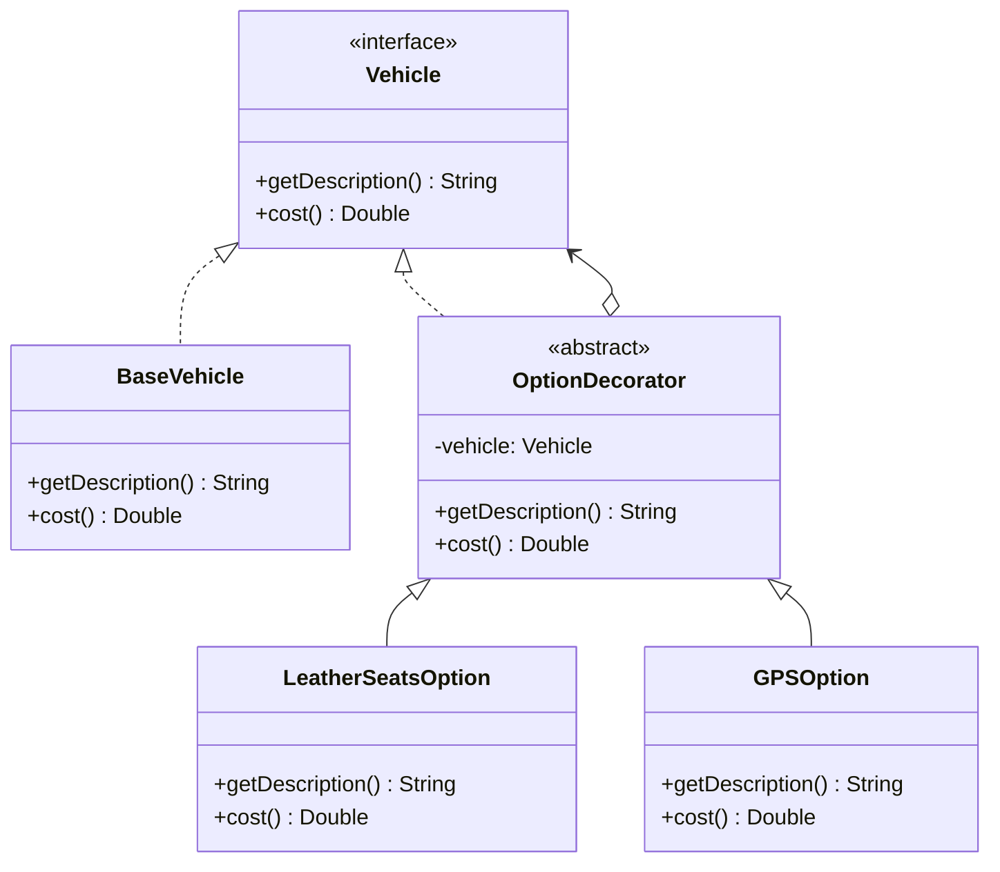

## 7. Iterator Pattern (Catalogue)

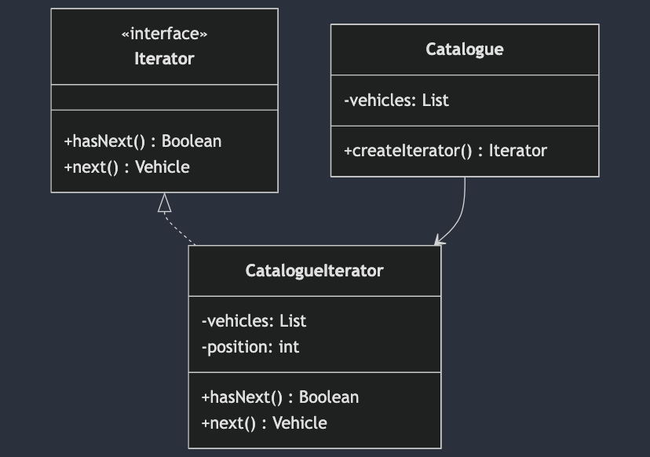

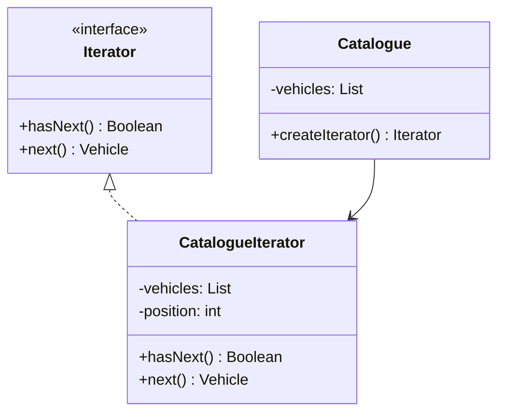

## 8. Template Method Pattern (Calcul Commande)

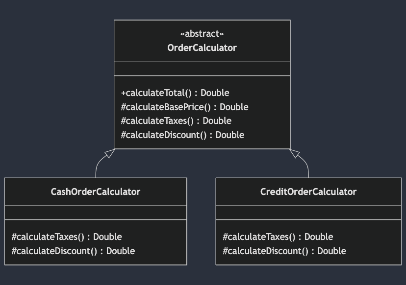

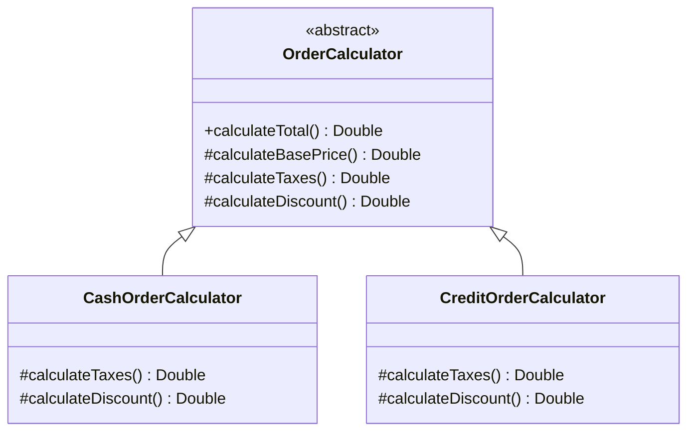
