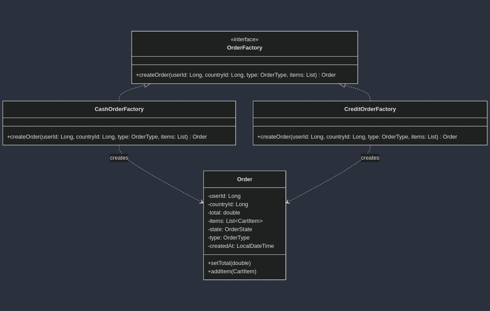
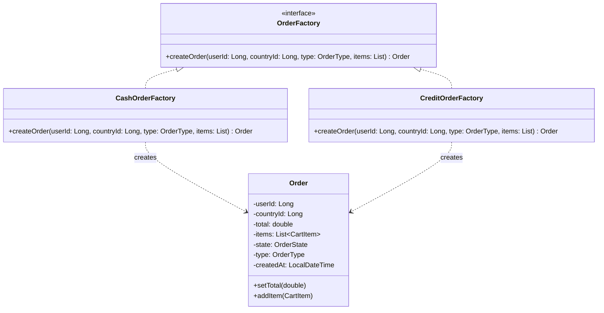
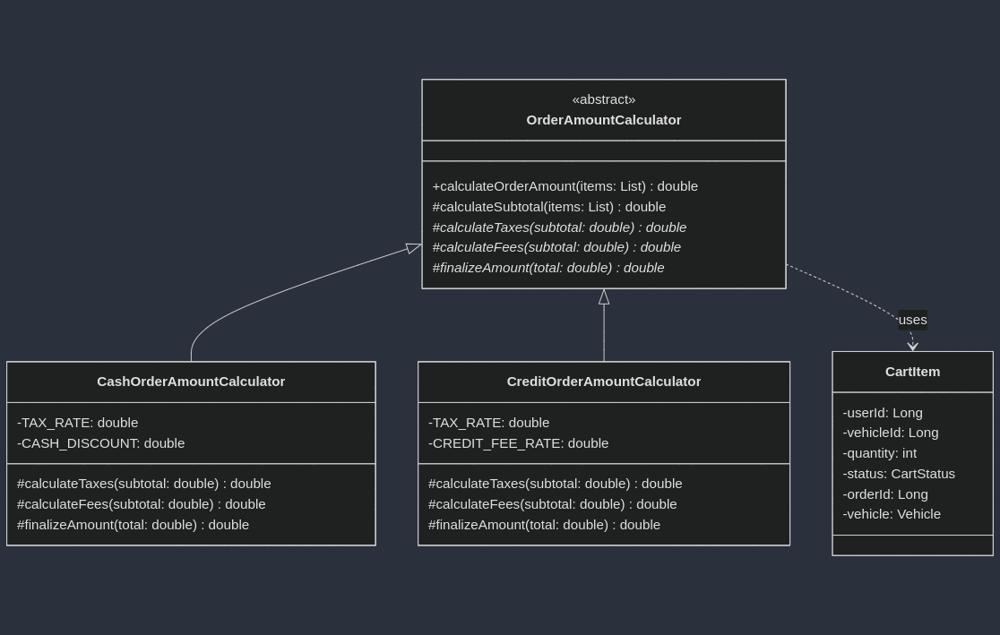
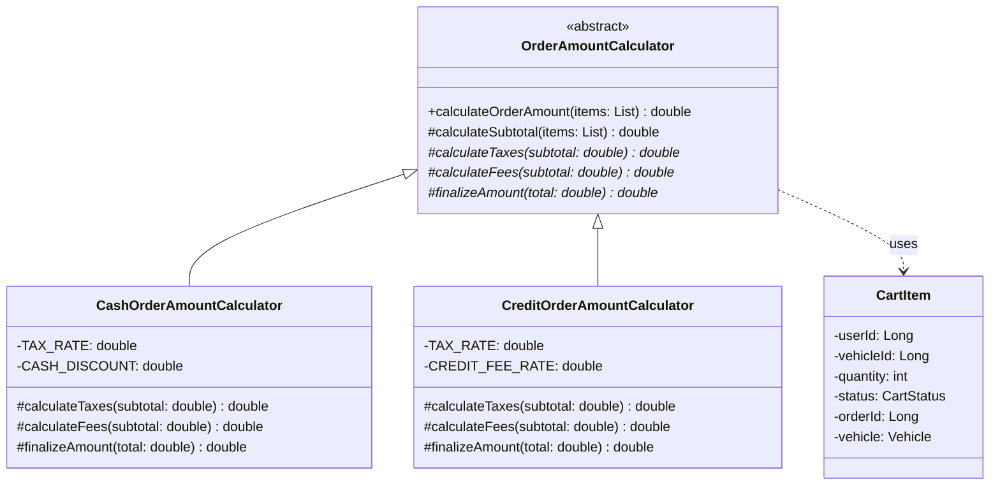

# Diagrammes des Design Patterns

## 1. Factory Method Pattern

```mermaid
classDiagram
    class OrderFactory {
        <<interface>>
        +createOrder(userId: Long, countryId: Long, type: OrderType, items: List) Order
    }
    class CashOrderFactory {
        +createOrder(userId: Long, countryId: Long, type: OrderType, items: List) Order
    }
    class CreditOrderFactory {
        +createOrder(userId: Long, countryId: Long, type: OrderType, items: List) Order
    }
    class Order {
        -userId: Long
        -countryId: Long
        -total: double
        -items: List~CartItem~
        -state: OrderState
        -type: OrderType
        -createdAt: LocalDateTime
        +setTotal(double)
        +addItem(CartItem)
    }

    OrderFactory <|.. CashOrderFactory
    OrderFactory <|.. CreditOrderFactory
    CashOrderFactory ..> Order : creates
    CreditOrderFactory ..> Order : creates
```

## 2. Template Method Pattern

```mermaid
classDiagram
    class OrderAmountCalculator {
        <<abstract>>
        +calculateOrderAmount(items: List) double
        #calculateSubtotal(items: List) double
        #calculateTaxes(subtotal: double)* double
        #calculateFees(subtotal: double)* double
        #finalizeAmount(total: double)* double
    }
    class CashOrderAmountCalculator {
        -TAX_RATE: double
        -CASH_DISCOUNT: double
        #calculateTaxes(subtotal: double) double
        #calculateFees(subtotal: double) double
        #finalizeAmount(total: double) double
    }
    class CreditOrderAmountCalculator {
        -TAX_RATE: double
        -CREDIT_FEE_RATE: double
        #calculateTaxes(subtotal: double) double
        #calculateFees(subtotal: double) double
        #finalizeAmount(total: double) double
    }
    class CartItem {
        -userId: Long
        -vehicleId: Long
        -quantity: int
        -status: CartStatus
        -orderId: Long
        -vehicle: Vehicle
    }

    OrderAmountCalculator <|-- CashOrderAmountCalculator
    OrderAmountCalculator <|-- CreditOrderAmountCalculator
    OrderAmountCalculator ..> CartItem : uses
```