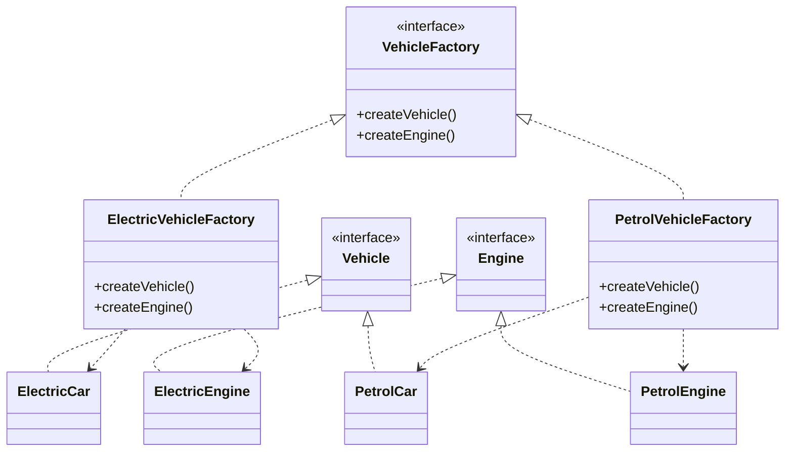
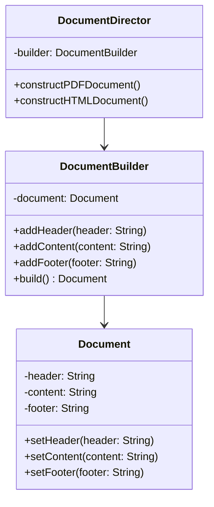
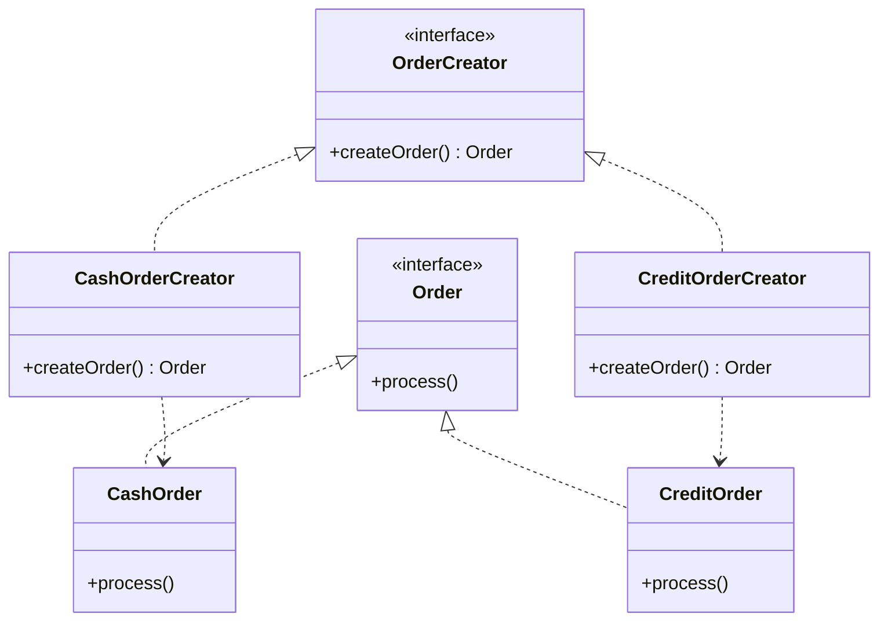
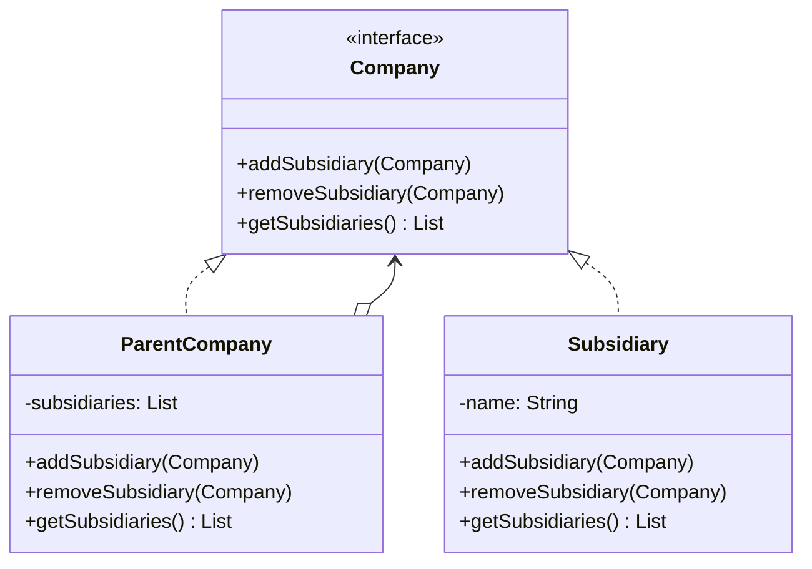
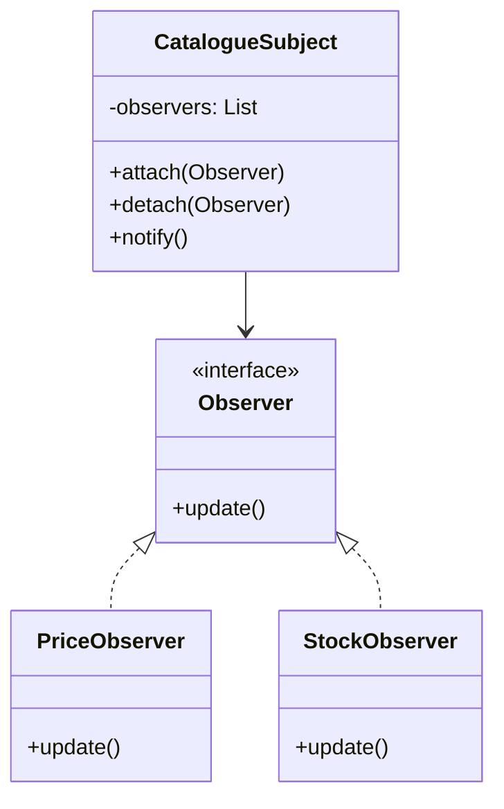
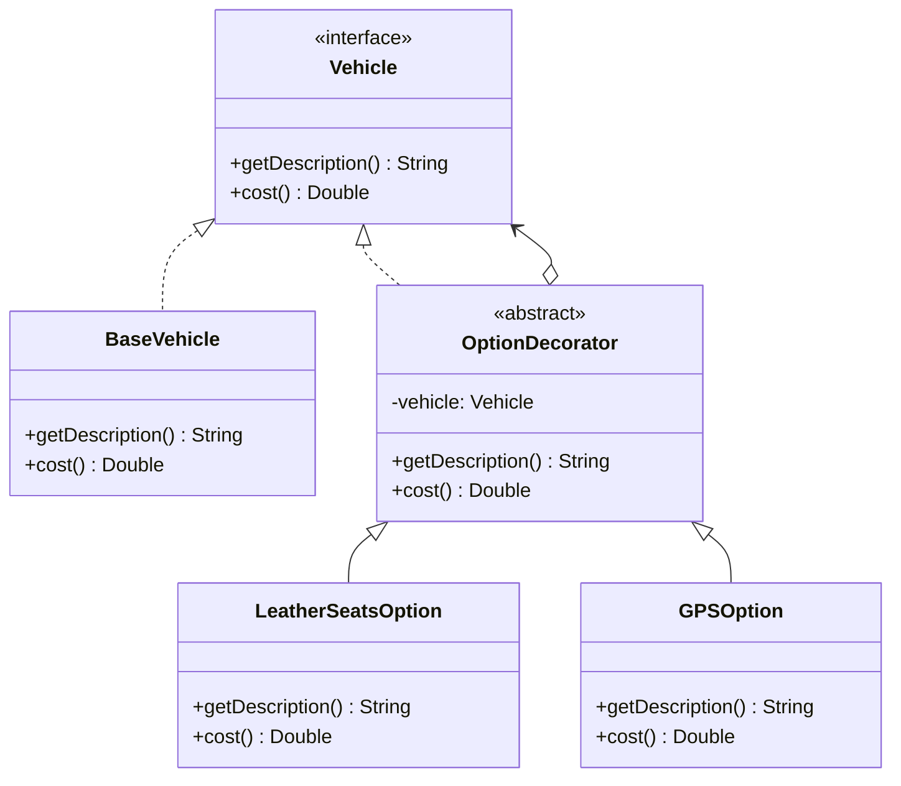
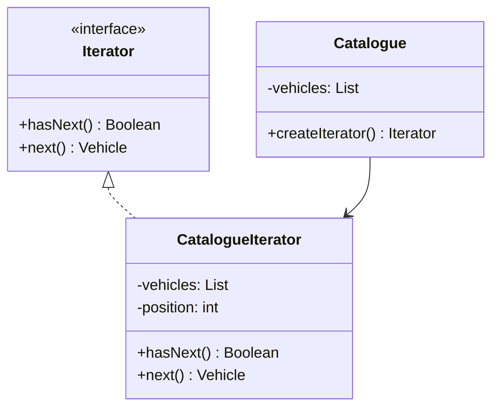
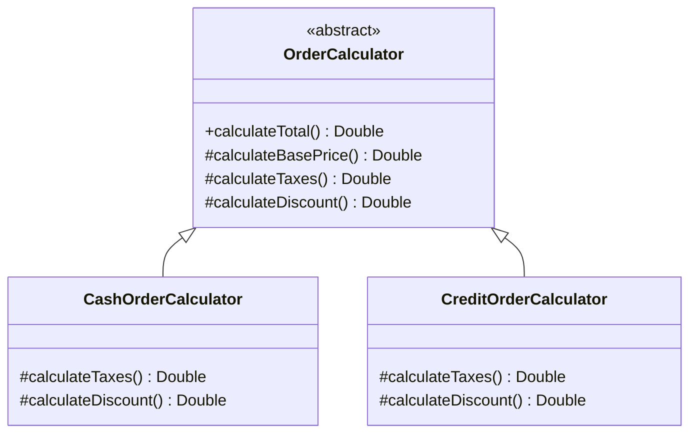

# Diagrammes à exporter

## 1. Abstract Factory Pattern

## 2. Builder Pattern

## 3. Factory Method Pattern

## 4. Composite Pattern

## 5. Observer Pattern

## 6. Decorator Pattern

## 7. Iterator Pattern

## 8. Template Method Pattern

Instructions :
1. Ouvrez https://mermaid.live/
2. Copiez chaque diagramme un par un
3. Téléchargez l'image PNG
4. Sauvegardez dans le dossier Documentation/images/
