# User Stories par Module

## 1. Module Authentification

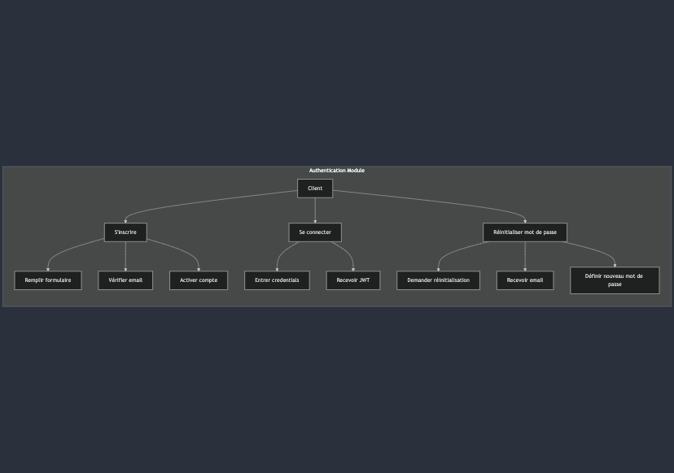

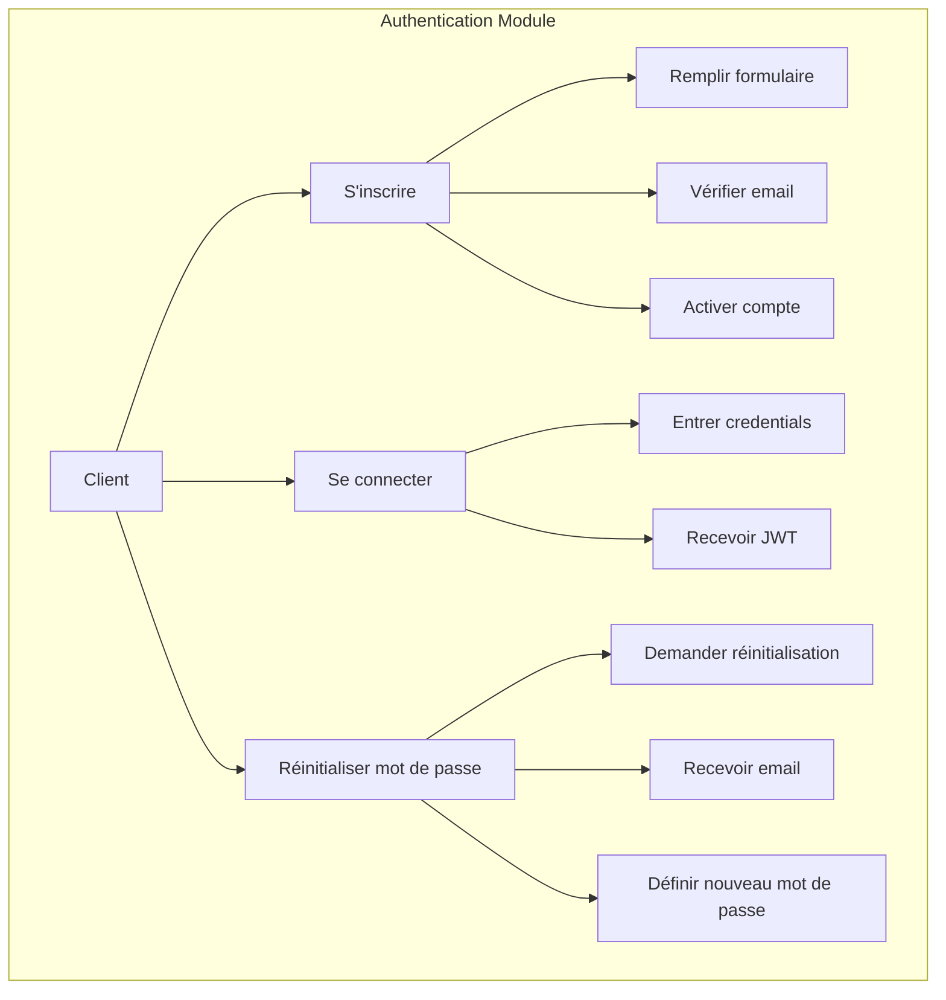

## 2. Module Catalogue

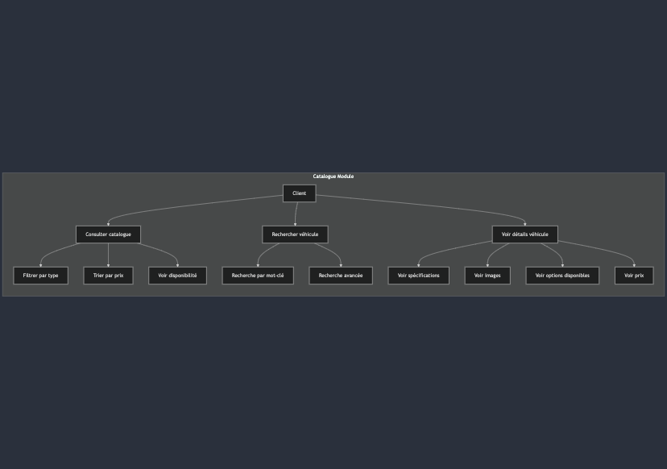

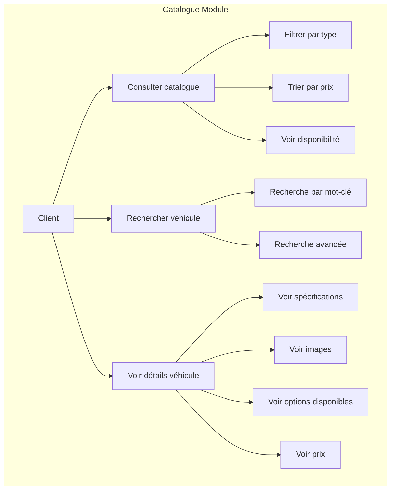

## 3. Module Commande

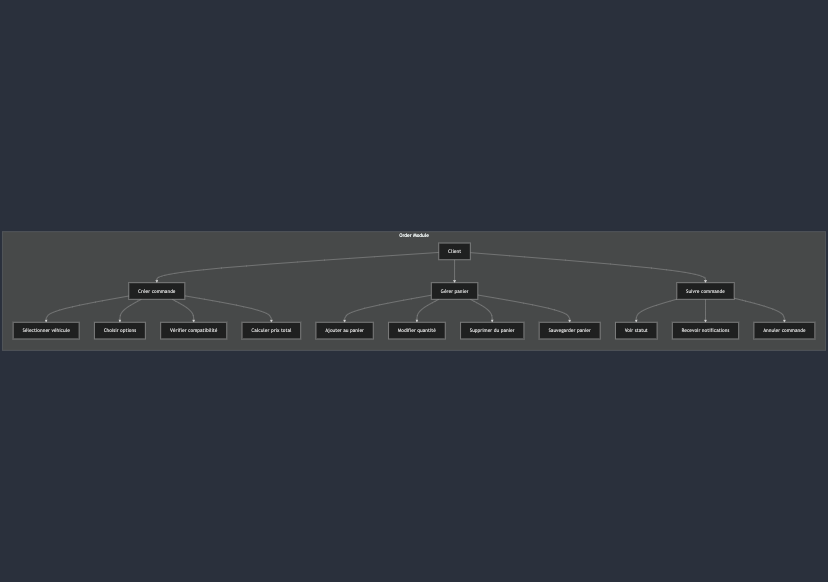

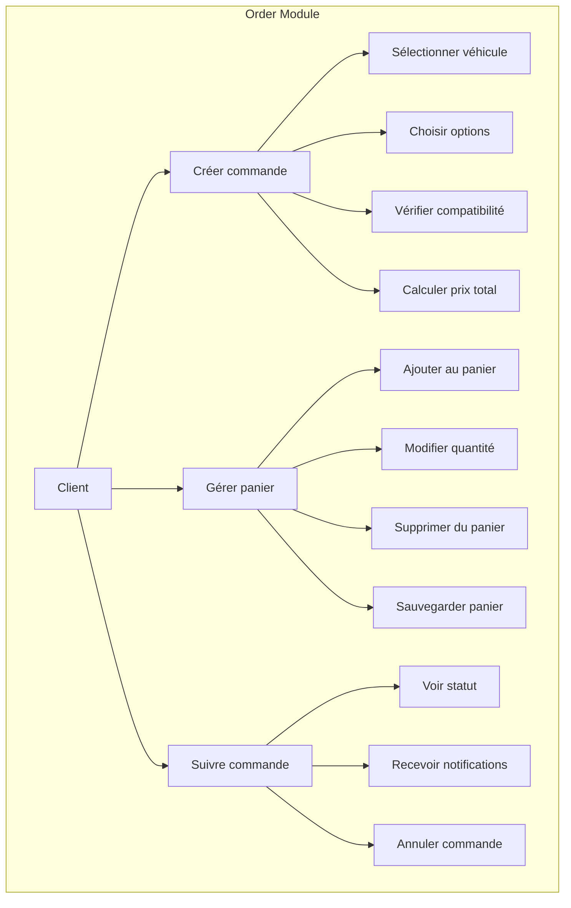

## 4. Module Document

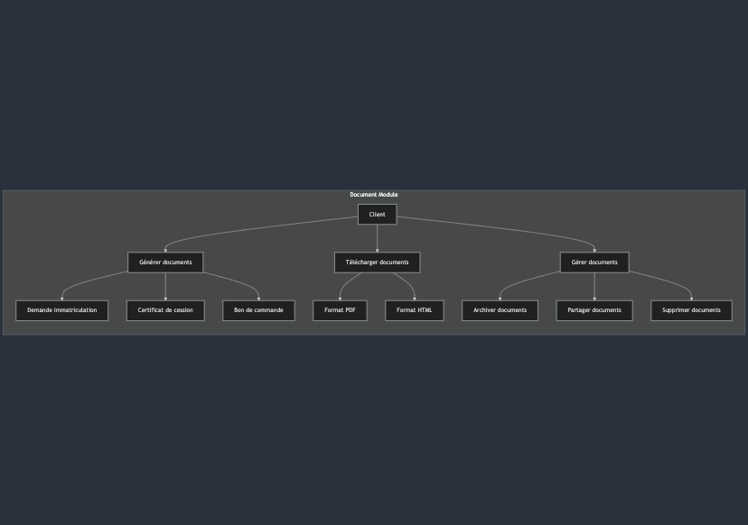

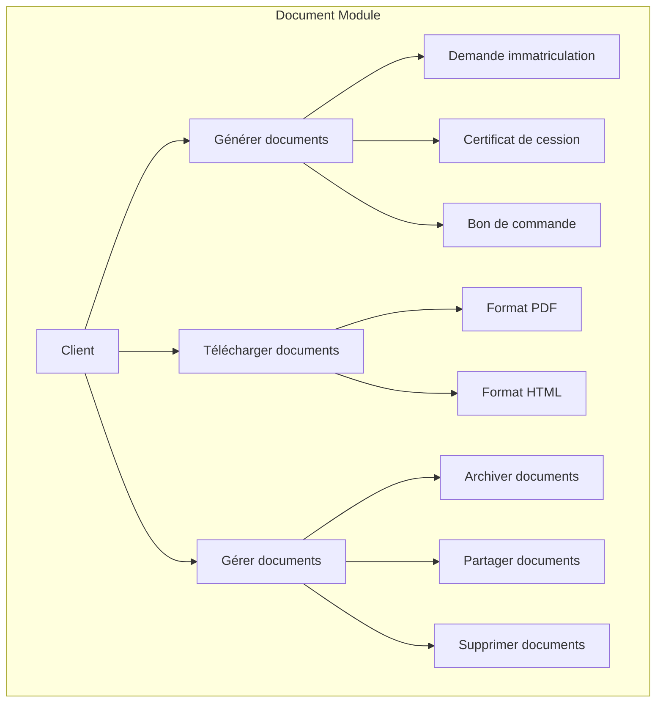

## 5. Module Client

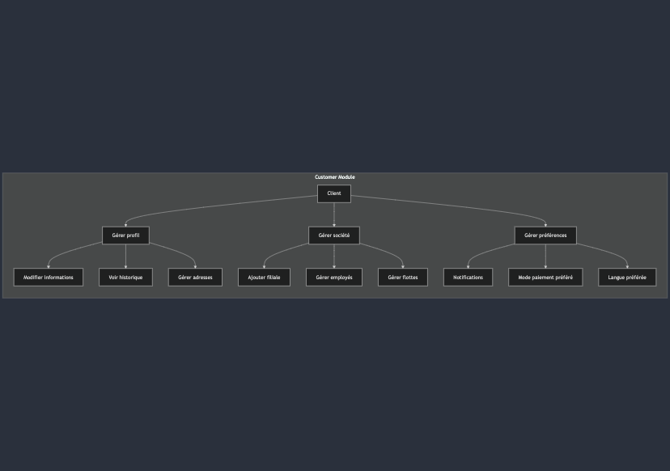

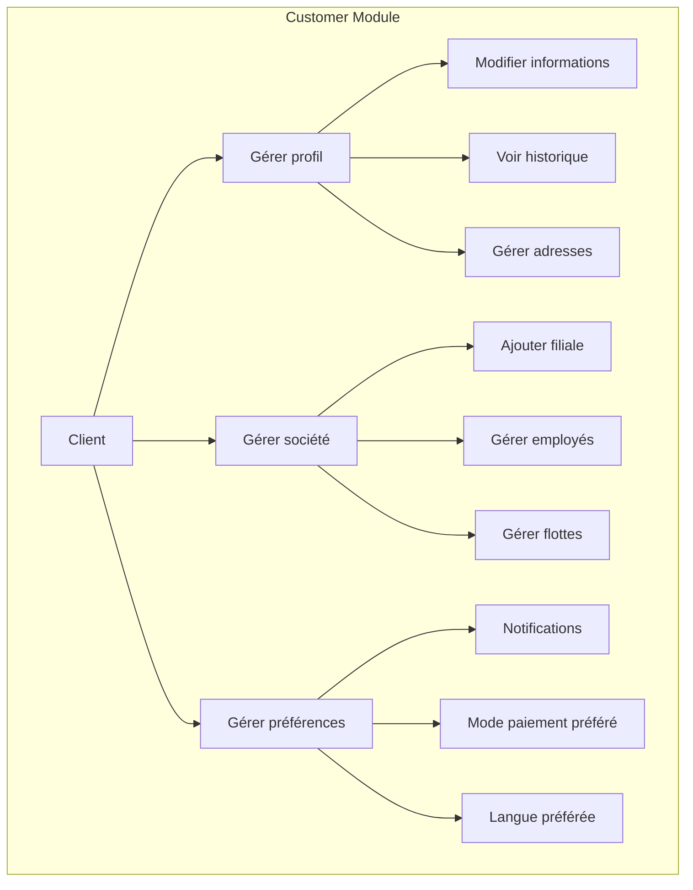

## 6. Module Paiement

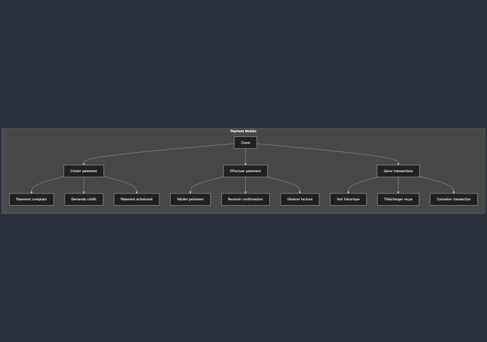

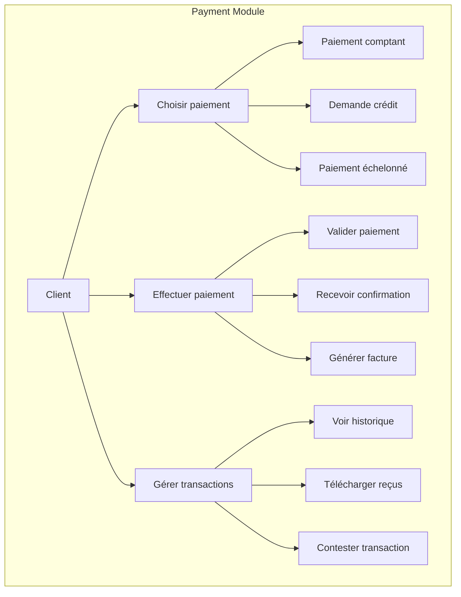

## 7. Module Administration

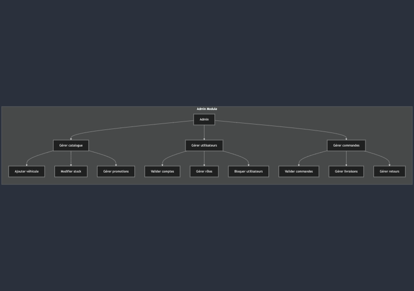

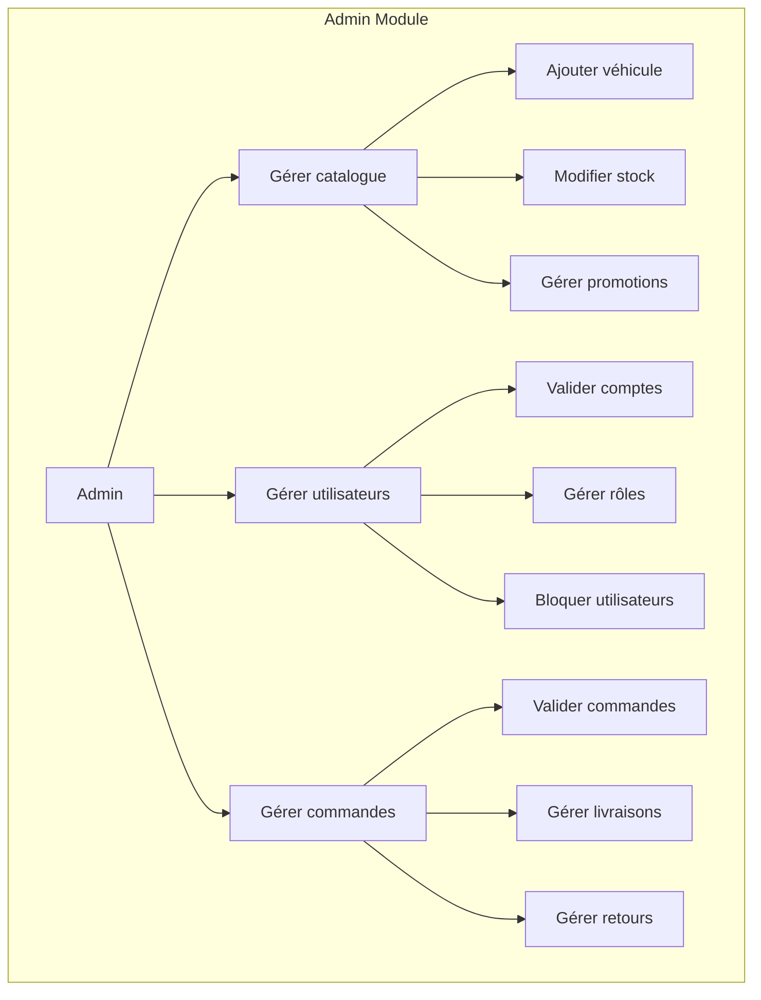

## 8. Module Reporting

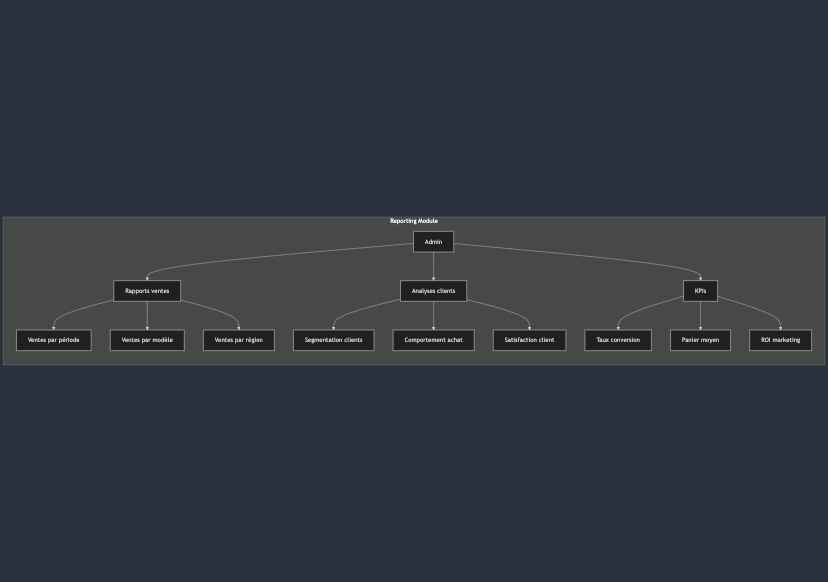

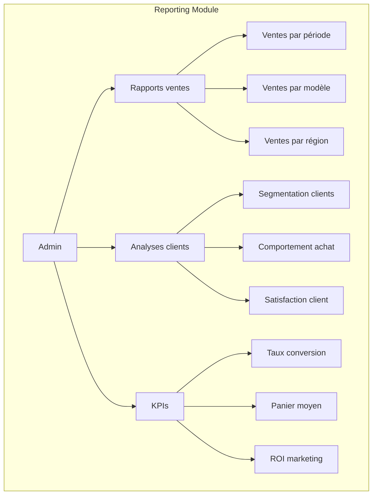

Chaque diagramme représente :

- Les acteurs principaux
- Les actions principales
- Les sous-actions et workflows
- Les interactions entre les différentes fonctionnalités

Ces user stories sont organisées de manière hiérarchique pour montrer :

1. L'objectif principal de chaque module
2. Les fonctionnalités détaillées
3. Les interactions utilisateur
4. Les résultats attendus

Voulez-vous que je détaille davantage certains modules ou que j'ajoute d'autres diagrammes ?
